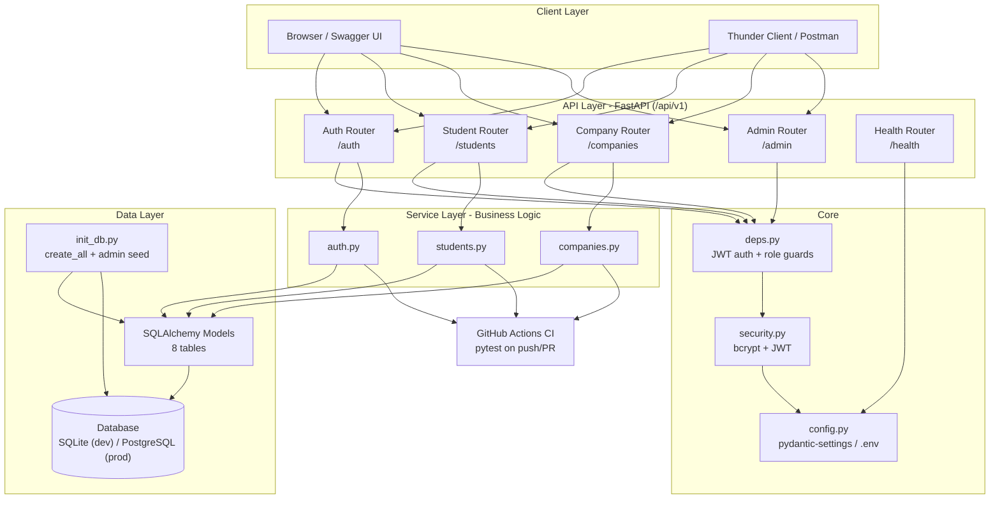
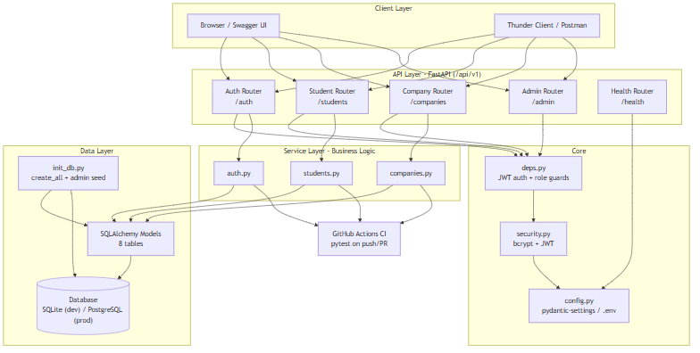

# Architecture Diagram

```mermaid
flowchart TB
    subgraph Client["Client Layer"]
        Browser["Browser / Swagger UI"]
        Thunder["Thunder Client / Postman"]
    end

    subgraph API["API Layer - FastAPI (/api/v1)"]
        AuthRouter["Auth Router\n/auth"]
        StudentRouter["Student Router\n/students"]
        CompanyRouter["Company Router\n/companies"]
        AdminRouter["Admin Router\n/admin"]
        HealthRouter["Health Router\n/health"]
    end

    subgraph Core["Core"]
        Deps["deps.py\nJWT auth + role guards"]
        Security["security.py\nbcrypt + JWT"]
        Config["config.py\npydantic-settings / .env"]
    end

    subgraph Service["Service Layer - Business Logic"]
        AuthService["auth.py"]
        StudentService["students.py"]
        CompanyService["companies.py"]
    end

    subgraph Data["Data Layer"]
        Models["SQLAlchemy Models\n8 tables"]
        InitDB["init_db.py\ncreate_all + admin seed"]
        DB[("Database\nSQLite (dev) / PostgreSQL (prod)")]
    end

    CI["GitHub Actions CI\npytest on push/PR"]

    Browser --> AuthRouter
    Browser --> StudentRouter
    Browser --> CompanyRouter
    Browser --> AdminRouter
    Thunder --> AuthRouter
    Thunder --> StudentRouter
    Thunder --> CompanyRouter
    Thunder --> AdminRouter

    AuthRouter --> Deps
    StudentRouter --> Deps
    CompanyRouter --> Deps
    AdminRouter --> Deps
    HealthRouter --> Config

    Deps --> Security
    Security --> Config

    AuthRouter --> AuthService
    StudentRouter --> StudentService
    CompanyRouter --> CompanyService

    AuthService --> Models
    StudentService --> Models
    CompanyService --> Models

    Models --> DB
    InitDB --> Models
    InitDB --> DB

    StudentService --> CI
    CompanyService --> CI
    AuthService --> CI
```

