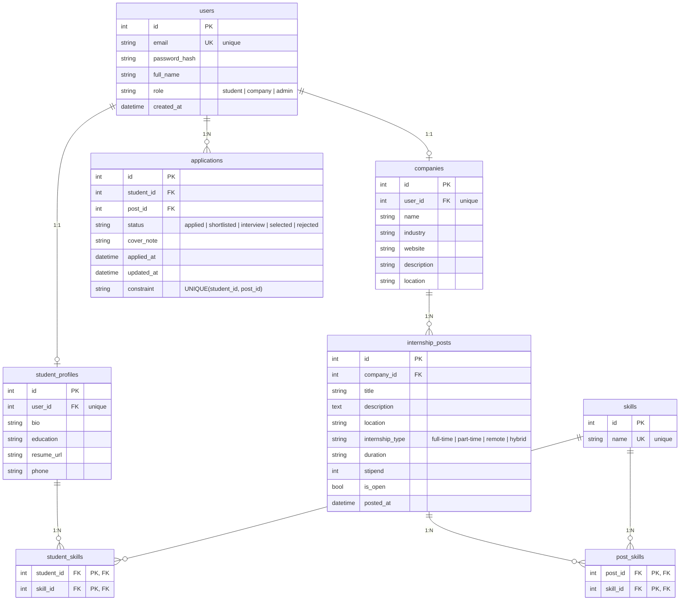

# Entity Relationship Diagram

```mermaid
erDiagram
    users ||--o| student_profiles : "1:1"
    users ||--o| companies : "1:1"
    users ||--o{ applications : "1:N"
    companies ||--o{ internship_posts : "1:N"
    internship_posts ||--o{ post_skills : "1:N"
    skills ||--o{ post_skills : "1:N"
    student_profiles ||--o{ student_skills : "1:N"
    skills ||--o{ student_skills : "1:N"

    users {
        int id PK
        string email UK "unique"
        string password_hash
        string full_name
        string role "student | company | admin"
        datetime created_at
    }

    student_profiles {
        int id PK
        int user_id FK "unique"
        string bio
        string education
        string resume_url
        string phone
    }

    companies {
        int id PK
        int user_id FK "unique"
        string name
        string industry
        string website
        string description
        string location
    }

    skills {
        int id PK
        string name UK "unique"
    }

    internship_posts {
        int id PK
        int company_id FK
        string title
        text description
        string location
        string internship_type "full-time | part-time | remote | hybrid"
        string duration
        int stipend
        bool is_open
        datetime posted_at
    }

    post_skills {
        int post_id FK "PK, FK"
        int skill_id FK "PK, FK"
    }

    student_skills {
        int student_id FK "PK, FK"
        int skill_id FK "PK, FK"
    }

    applications {
        int id PK
        int student_id FK
        int post_id FK
        string status "applied | shortlisted | interview | selected | rejected"
        string cover_note
        datetime applied_at
        datetime updated_at
        string constraint "UNIQUE(student_id, post_id)"
    }
```

