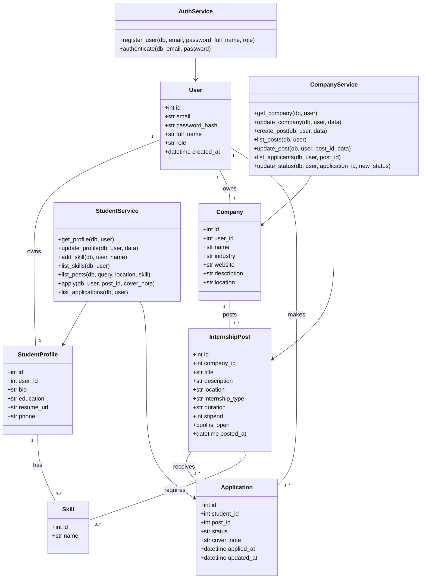
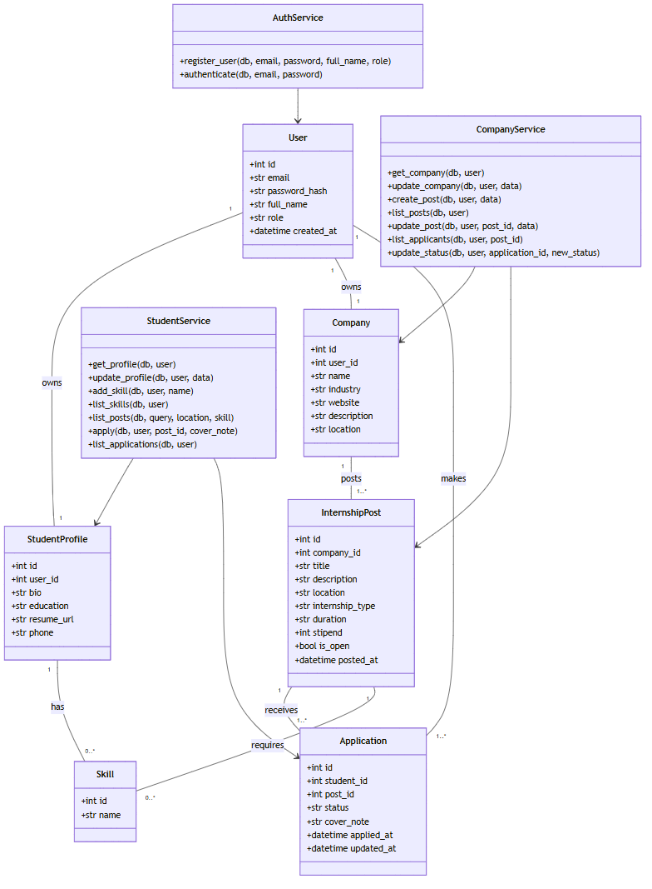

# Module / Class Diagram

```mermaid
classDiagram
    class User {
        +int id
        +str email
        +str password_hash
        +str full_name
        +str role
        +datetime created_at
    }

    class StudentProfile {
        +int id
        +int user_id
        +str bio
        +str education
        +str resume_url
        +str phone
    }

    class Company {
        +int id
        +int user_id
        +str name
        +str industry
        +str website
        +str description
        +str location
    }

    class Skill {
        +int id
        +str name
    }

    class InternshipPost {
        +int id
        +int company_id
        +str title
        +str description
        +str location
        +str internship_type
        +str duration
        +int stipend
        +bool is_open
        +datetime posted_at
    }

    class Application {
        +int id
        +int student_id
        +int post_id
        +str status
        +str cover_note
        +datetime applied_at
        +datetime updated_at
    }

    User "1" -- "1" StudentProfile : owns
    User "1" -- "1" Company : owns
    User "1" -- "1..*" Application : makes
    Company "1" -- "1..*" InternshipPost : posts
    InternshipPost "1" -- "1..*" Application : receives
    InternshipPost "1" -- "0..*" Skill : requires
    StudentProfile "1" -- "0..*" Skill : has

    class AuthService {
        +register_user(db, email, password, full_name, role)
        +authenticate(db, email, password)
    }

    class StudentService {
        +get_profile(db, user)
        +update_profile(db, user, data)
        +add_skill(db, user, name)
        +list_skills(db, user)
        +list_posts(db, query, location, skill)
        +apply(db, user, post_id, cover_note)
        +list_applications(db, user)
    }

    class CompanyService {
        +get_company(db, user)
        +update_company(db, user, data)
        +create_post(db, user, data)
        +list_posts(db, user)
        +update_post(db, user, post_id, data)
        +list_applicants(db, user, post_id)
        +update_status(db, user, application_id, new_status)
    }

    AuthService --> User
    StudentService --> StudentProfile
    StudentService --> Application
    CompanyService --> Company
    CompanyService --> InternshipPost
```

